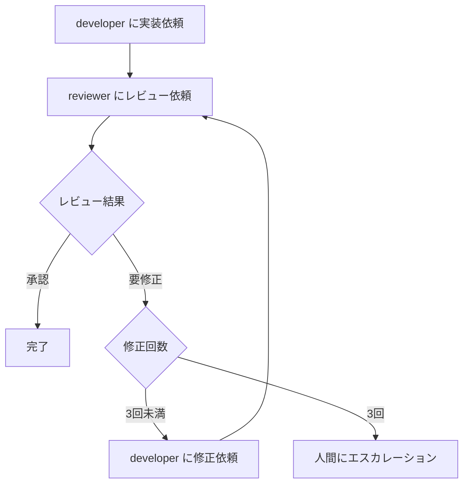

# develop-issue - Issue単位の開発実行

Issue番号を指定して、developer/reviewer サブエージェントに開発を委譲します。

## 実行手順

### 1. Issue情報の取得（必要な場合のみ実施）

Issue内容を把握していない場合のみ実行:

```bash
gh issue view <issue-number> --json title,body,state
```

### 2. git worktree の作成

作業用の worktree を作成し、その中でサブエージェントが作業します。

共通ルール: @../worktree-rules.md

```bash
git worktree add ./worktree/issue-<issue-number> -b issue-<issue-number>
```

### 3. 開発サイクル



1. **developer エージェントに実装を依頼**
   - Issue番号を渡す
   - 完了報告を受け取る

2. **reviewer エージェントにレビューを依頼**（最低1回必須）
   - Issue番号と開発完了報告を渡す
   - レビュー観点を指定する
   - 指摘事項リストと総合判定（承認可/要修正）を受け取る

3. **レビュー結果に応じた処理**
   - 承認可: 完了へ
   - 要修正: 修正サイクルへ（最大3回まで）

4. **修正サイクル**（要修正の場合）
   - developer エージェントに修正を依頼（レビュー指摘事項を渡す）
   - reviewer エージェントに再レビューを依頼
   - 3回修正しても承認されない場合は、人間にエスカレーション

## サブエージェントへの依頼

Task ツールを使用してサブエージェントに依頼します。

### developer への依頼

- 新規実装: `Task(subagent_type="developer", prompt="Issue #<number> の実装をお願いします。")`
- 修正依頼: `Task(subagent_type="developer", prompt="Issue #<number> の修正をお願いします。\n\nレビュー指摘事項:\n<review-comments>")`

### reviewer への依頼

```
Task(subagent_type="reviewer", prompt="Issue #<number> のレビューをお願いします。

開発完了報告:
<dev-report>

レビュー観点:
<Issue内容に応じて追加で必要だと思う観点（あれば）>
")
```

## 出力

完了時に以下を報告:
- 実装内容のサマリー
- レビュー結果（承認/修正回数）
- 作成されたコミット/ブランチ情報
