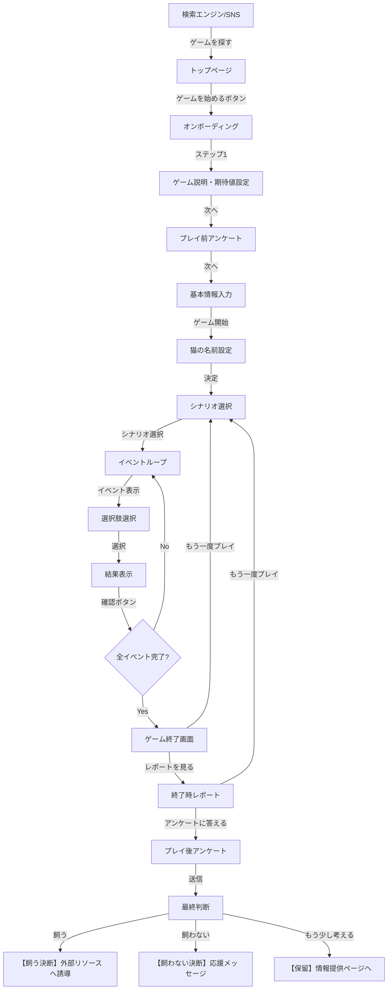

# UXフロー設計

## 概要

本ドキュメントでは、「君はねこを飼えるか？」のユーザー体験全体の流れと、各画面のUIイメージを定義します。

---

## 全体フロー



---

## 画面詳細設計

### 1. トップページ

**目的**: プロジェクトの目的を伝え、ゲームへの期待値を設定

**UIレイアウト**:
```
┌──────────────────────────────────┐
│                                  │
│    君はねこを飼えるか？           │
│    プロトタイプ版                 │
│    飼う前に、猫を知ろう            │
│                                  │
│  ┌────────────────────────────┐  │
│  │ このゲームについて             │  │
│  │                              │  │
│  │ このゲームは「ねこを飼うか   │  │
│  │ 迷っている人」に向けた、     │  │
│  │ 判断材料を提供するシミュレー │  │
│  │ ションです。                 │  │
│  │                              │  │
│  │ 📊 令和5年度の猫の殺処分数:  │  │
│  │    6,899頭                   │  │
│  │                              │  │
│  │ 「やっぱり飼わない」という   │  │
│  │ 選択も、成功です。           │  │
│  └────────────────────────────┘  │
│                                  │
│      [ゲームを始める]             │
│                                  │
└──────────────────────────────────┘
```

**実装状態**: ✅ 完了（プロトタイプ版として実装済み）

---

### 2. オンボーディング（3ステップ統合画面）

**目的**: ユーザーの初期状態を把握し、基本情報を収集

**UIレイアウト**:
```
┌──────────────────────────────────┐
│  プロフィール設定                 │
│  ━━━━━━━━━━━━━━━━━━━━━━━━━━━  │
│                                  │
│  【ステップ1/3: ゲームの目的】    │
│                                  │
│  このゲームは「気づき」を与える   │
│  ツールです。                     │
│  - 責任感を押し付けない           │
│  - リアルな大変さを体験           │
│  - 「やめた」も成功               │
│                                  │
│      [次へ] [スキップ]             │
│                                  │
├──────────────────────────────────┤
│  【ステップ2/3: あなたについて】  │
│                                  │
│  猫を飼いたいと思っていますか？   │
│  ○ 非常に飼いたい                │
│  ○ やや飼いたい                  │
│  ○ 迷っている                    │
│  ○ あまり飼いたくない            │
│                                  │
│  飼育に対する不安はありますか？   │
│  □ 時間的負担                    │
│  □ 経済的負担                    │
│  □ 住環境                        │
│  □ 睡眠への影響                  │
│  □ 衛生面                        │
│  □ 生活の自由度                  │
│  □ その他                        │
│                                  │
│      [戻る] [次へ]                │
│                                  │
├──────────────────────────────────┤
│  【ステップ3/3: 基本情報】        │
│                                  │
│  自由に使えるお金/月: [     ]円  │
│  ※ 初期費用2〜3万円、            │
│    月5,000〜10,000円が目安       │
│                                  │
│  自由時間/日: [  ]時間           │
│  ※ 朝夕最低30分、トイレ掃除など  │
│                                  │
│  住環境:                         │
│  ○ 持ち家ペット可                │
│  ○ 賃貸ペット可                  │
│  ○ 賃貸ペット不可                │
│  ○ その他                        │
│                                  │
│  ⚠️ 賃貸ペット不可の場合、        │
│     飼育は推奨されません          │
│                                  │
│      [戻る] [ゲーム開始]          │
│                                  │
└──────────────────────────────────┘
```

**実装状態**: 🟡 未実装（MVP必須）

**実装優先度**: 高（プロトタイプ後、最初に実装）

---

### 3. 猫の名前設定

**目的**: ゲームへの没入感を高める

**UIレイアウト**:
```
┌──────────────────────────────────┐
│                                  │
│  あなたは猫を迎えることになりました│
│                                  │
│  猫の名前を教えてください:        │
│  ┌──────────────────┐            │
│  │ たま            │            │
│  └──────────────────┘            │
│                                  │
│      [決定]                       │
│                                  │
└──────────────────────────────────┘
```

**実装状態**: 🟡 未実装（プロトタイプでは固定名「たま」）

---

### 3-2. シナリオ選択

**目的**: ユーザーに体験したいシナリオを選択させる

**UIレイアウト**:

```
┌──────────────────────────────────┐
│  シナリオを選んでください          │
│  ━━━━━━━━━━━━━━━━━━━━━━━━━━━  │
│                                  │
│  どのシナリオを体験しますか？      │
│                                  │
│  ┌────────────────────────────┐  │
│  │ 📅 1週間コース（推奨）      │  │
│  │                            │  │
│  │ プレイ時間: 約30分          │  │
│  │ イベント数: 20個            │  │
│  │                            │  │
│  │ 日常のお世話、睡眠不足、    │  │
│  │ 問題行動などを体験できます。│  │
│  │                            │  │
│  │      [プレイする]           │  │
│  └────────────────────────────┘  │
│                                  │
│  ┌────────────────────────────┐  │
│  │ 📅 1ヶ月コース              │  │
│  │                            │  │
│  │ プレイ時間: 約90分          │  │
│  │ イベント数: 60個            │  │
│  │                            │  │
│  │ 想定外の出来事、費用の累積、│  │
│  │ より深い気づきを体験。      │  │
│  │                            │  │
│  │      [プレイする]           │  │
│  └────────────────────────────┘  │
│                                  │
│  ┌────────────────────────────┐  │
│  │ 🏠 多頭飼いシナリオ         │  │
│  │                            │  │
│  │ プレイ時間: 約60分          │  │
│  │                            │  │
│  │ 2匹の猫を同時に飼育。       │  │
│  │ 猫同士の相性、費用2倍など。 │  │
│  │                            │  │
│  │      [プレイする]           │  │
│  └────────────────────────────┘  │
│                                  │
│  ┌────────────────────────────┐  │
│  │ 🐾 保護猫シナリオ           │  │
│  │                            │  │
│  │ プレイ時間: 約45分          │  │
│  │                            │  │
│  │ トラウマを抱えた保護猫。    │  │
│  │ 懐かせる難しさを体験。      │  │
│  │                            │  │
│  │      [プレイする]           │  │
│  └────────────────────────────┘  │
│                                  │
│  ┌────────────────────────────┐  │
│  │ 🩺 老猫介護シナリオ         │  │
│  │                            │  │
│  │ プレイ時間: 約50分          │  │
│  │                            │  │
│  │ 高齢猫の介護。通院、投薬、  │  │
│  │ 最期の看取りまで。          │  │
│  │                            │  │
│  │      [プレイする]           │  │
│  └────────────────────────────┘  │
│                                  │
│  💡 初めての方は「1週間コース」がおすすめ│
│                                  │
│      [戻る]                       │
│                                  │
└──────────────────────────────────┘
```

**シナリオ拡張性**:
- 各シナリオは独立したデータセットとして管理
- 新しいシナリオは追加で実装可能
- 難易度、テーマ別でカテゴリ分け可能
- 将来的にはユーザーの選択履歴に応じたレコメンド機能も検討

**実装状態**: 🟡 未実装（MVP期は1週間固定、将来バージョンで選択制）

**実装優先度**: 低（将来バージョン）

**MVP版の対応**:
- MVP期は「1週間コース」のみ実装
- シナリオ選択画面はスキップし、直接ゲーム開始
- 将来バージョンで選択画面を追加

---

### 4. ゲーム画面（メイン）

**目的**: イベントを体験し、選択肢を通じて「気づき」を得る

**UIレイアウト**:
```
┌──────────────────────────────────┐
│ 君はねこを飼えるか？  イベント 1/10│
├──────────────────────────────────┤
│                                  │
│  ┌────────────────────────────┐  │
│  │                            │  │
│  │   [Phaserアニメーション]    │  │
│  │                            │  │
│  │   🐱 猫の様子を表示         │  │
│  │      (状態に応じた表情)     │  │
│  │                            │  │
│  └────────────────────────────┘  │
│                                  │
├──────────────────────────────────┤
│  【🐱 たまの状態】                │
│  なつき度: ███████░░░ 70         │
│  ストレス: ████░░░░░ 40          │
│  健康度:   ██████████ 100        │
│  空腹度:   ████░░░░░ 40          │
├──────────────────────────────────┤
│                                  │
│  【朝の餌やり】                   │
│                                  │
│  朝6時、猫が「にゃーにゃー」と    │
│  鳴きながらあなたのベッドに       │
│  乗ってきました。                 │
│  お腹を空かせているようです。     │
│                                  │
│  ┌────────────────────────────┐  │
│  │  起きて餌をやる              │  │
│  └────────────────────────────┘  │
│  ┌────────────────────────────┐  │
│  │  もう少し寝る（無視する）    │  │
│  └────────────────────────────┘  │
│                                  │
└──────────────────────────────────┘
```

**Phaserアニメーション部分の詳細**:
- 猫のキャラクター表示（静止画 or シンプルなアニメーション）
- 状態に応じた表情変化（健康、不機嫌、幸せ、眠い、お腹空いた など）
- イベントに応じた動作（食べる、寝る、遊ぶ、鳴く など）
- MVP期は静止画 + 最小限のアニメーションで実装

**実装状態**: ✅ テキスト部分は完了、Phaserは未実装

---

### 5. イベント結果表示

**目的**: 選択の結果を伝え、パラメータ変化を可視化

**UIレイアウト**:
```
┌──────────────────────────────────┐
│  【結果】                         │
│                                  │
│  猫は嬉しそうに餌を食べました。   │
│  あなたはそのまま支度を始めました │
│  が、少し眠そうです。             │
│                                  │
│  ━━━━━━━━━━━━━━━━━━━━━━━━━━━  │
│  変化:                           │
│  なつき度: 50 → 60 (+10) ↑      │
│  空腹度:   50 → 20 (-30) ↓      │
│  ━━━━━━━━━━━━━━━━━━━━━━━━━━━  │
│                                  │
│      [確認]                       │
│                                  │
└──────────────────────────────────┘
```

**実装状態**: ✅ プロトタイプで実装済み

---

### 6. ゲーム終了画面

**目的**: プレイ完了を祝福し、レポートへ誘導

**UIレイアウト**:
```
┌──────────────────────────────────┐
│                                  │
│  プロトタイプ終了                 │
│                                  │
│  お疲れさまでした！               │
│  たまとの3つのイベントを          │
│  体験しました。                   │
│                                  │
│  ┌────────────────────────────┐  │
│  │ 最終ステータス                │  │
│  │ なつき度:   70               │  │
│  │ ストレス度: 40               │  │
│  │ 健康度:     100              │  │
│  │ 空腹度:     20               │  │
│  └────────────────────────────┘  │
│                                  │
│      [レポートを見る]             │
│      [もう一度プレイ]             │
│                                  │
└──────────────────────────────────┘
```

**実装状態**: ✅ プロトタイプで実装済み

---

### 7. 終了時レポート

**目的**: 体験を振り返り、気づきを促す

**UIレイアウト**:
```
┌──────────────────────────────────┐
│  あなたの飼育適性診断              │
│  ━━━━━━━━━━━━━━━━━━━━━━━━━━━  │
│                                  │
│  【あなたの飼育スタイル】          │
│  マメなタイプ                     │
│                                  │
│  【苦手だったこと】               │
│  - 睡眠不足への対応               │
│  - トイレ掃除の継続               │
│                                  │
│  【得意だったこと】               │
│  - 遊び相手                       │
│  - スキンシップ                   │
│                                  │
│  ━━━━━━━━━━━━━━━━━━━━━━━━━━━  │
│                                  │
│  【統計データとの比較】            │
│                                  │
│  あなたが体験した22のシーンは、    │
│  実際の飼育放棄理由に基づいています│
│                                  │
│  📊 令和5年度の猫の殺処分数:      │
│     6,899頭                      │
│                                  │
│  主な原因:                        │
│  - 飼い主の病気・介護 (32%)       │
│  - 転居 (10%)                    │
│  - 離婚 (8%)                     │
│  - 問題行動 (3%)                 │
│                                  │
│  睡眠不足で苦労したあなたは、      │
│  実際の飼い主の43%と同じです。    │
│                                  │
│  ━━━━━━━━━━━━━━━━━━━━━━━━━━━  │
│                                  │
│  【⚠️ 重要な注意】                │
│                                  │
│  ゲームで飼えた ≠ 実際に飼える    │
│                                  │
│  実際はもっと大変です。            │
│  この体験を踏まえて、              │
│  慎重に判断してください。          │
│                                  │
│      [アンケートに答える]          │
│      [もう一度プレイ]             │
│                                  │
└──────────────────────────────────┘
```

**実装状態**: 🟡 未実装（MVP必須）

---

### 8. プレイ後アンケート

**目的**: 行動変容を測定

**UIレイアウト**:
```
┌──────────────────────────────────┐
│  プレイ後アンケート                │
│  ━━━━━━━━━━━━━━━━━━━━━━━━━━━  │
│                                  │
│  Q1. プレイ後、猫を飼いたいと     │
│      思いますか？                 │
│                                  │
│  ○ 非常に飼いたい                │
│  ○ やや飼いたい                  │
│  ○ もう少し考えたい              │
│  ○ やめておこうと思う            │
│                                  │
│  ━━━━━━━━━━━━━━━━━━━━━━━━━━━  │
│                                  │
│  Q2. プレイ前と比べて、           │
│      飼育に対する理解は           │
│      深まりましたか？             │
│                                  │
│  ☆☆☆☆☆ (5段階評価)           │
│                                  │
│  ━━━━━━━━━━━━━━━━━━━━━━━━━━━  │
│                                  │
│  Q3. どのシーンが最も             │
│      印象に残りましたか？         │
│                                  │
│  ┌──────────────────────────┐  │
│  │                            │  │
│  │ (自由記述)                 │  │
│  │                            │  │
│  └──────────────────────────┘  │
│                                  │
│  ━━━━━━━━━━━━━━━━━━━━━━━━━━━  │
│                                  │
│      [送信]                       │
│                                  │
└──────────────────────────────────┘
```

**実装状態**: 🟡 未実装（MVP必須）

---

### 9. 最終判断画面

**目的**: ゲーム後の行動を促す

**UIレイアウト**:
```
┌──────────────────────────────────┐
│  あなたの決断                     │
│  ━━━━━━━━━━━━━━━━━━━━━━━━━━━  │
│                                  │
│  アンケートへのご協力             │
│  ありがとうございました。         │
│                                  │
│  最後に、あなたの決断を           │
│  お聞かせください。               │
│                                  │
│  ┌────────────────────────────┐  │
│  │ 🐱 猫を飼う決断をした       │  │
│  │                            │  │
│  │ 次のステップへ進む:         │  │
│  │ - 保護猫団体の紹介         │  │
│  │ - ペットショップ検索       │  │
│  │ - 飼育準備チェックリスト   │  │
│  │                            │  │
│  │      [リソースを見る]       │  │
│  └────────────────────────────┘  │
│                                  │
│  ┌────────────────────────────┐  │
│  │ 💭 飼わない決断をした       │  │
│  │                            │  │
│  │ それも立派な決断です！      │  │
│  │ この体験があなたの役に      │  │
│  │ 立ったことを願っています。  │  │
│  │                            │  │
│  │      [応援メッセージ]       │  │
│  └────────────────────────────┘  │
│                                  │
│  ┌────────────────────────────┐  │
│  │ 🤔 もう少し考える          │  │
│  │                            │  │
│  │ さらに情報を集めたい方へ:   │  │
│  │ - 猫の飼育ガイド           │  │
│  │ - よくある質問             │  │
│  │ - 獣医師に相談する         │  │
│  │                            │  │
│  │      [情報を見る]           │  │
│  └────────────────────────────┘  │
│                                  │
│      [もう一度プレイ]             │
│                                  │
└──────────────────────────────────┘
```

**実装状態**: 🟡 未実装（MVP推奨）

---

## ゲーム外の体験

### ゲームの発見（ゲームプレイ前）

**目的**: ユーザーがゲームに辿り着く経路を想定

**流入経路**:
1. **検索エンジン**:
   - キーワード: 「猫 飼う 診断」「猫 飼育 シミュレーション」
   - SEO対策: タイトル、メタディスクリプション最適化
2. **SNS**:
   - Twitter/X: ハッシュタグ #君はねこを飼えるか
   - Instagram: 猫好きコミュニティへの投稿
3. **口コミ**:
   - 友人からの紹介
   - 猫関連コミュニティでの共有

**実装状態**: 🟡 将来バージョン（ASO、SNS戦略）

---

### ソーシャルシェア（将来バージョン）

**目的**: 認知拡大

**機能**:
- 終了時レポート画面にシェアボタンを配置
- Twitter/X: 「私の飼育適性診断結果: マメなタイプ | #君はねこを飼えるか」
- LINE: 友達にゲームをおすすめ

**実装状態**: 🟡 将来バージョン

---

### データ分析ダッシュボード（管理者用・将来バージョン）

**目的**: プロダクト改善のためのデータ収集

**機能**:
- イベント別の離脱率グラフ
- 選択肢の選択率分布
- 行動変容率の可視化

**実装状態**: 🟡 将来バージョン

---

## 実装優先順位サマリー

| 画面 | 実装状態 | 優先度 |
|------|---------|--------|
| トップページ | ✅ 完了 | - |
| オンボーディング | 🟡 未実装 | 高（MVP必須） |
| 猫の名前設定 | 🟡 未実装 | 中（MVP推奨） |
| シナリオ選択 | 🟡 未実装 | 低（将来バージョン） |
| ゲーム画面（テキスト） | ✅ 完了 | - |
| ゲーム画面（Phaser） | 🟡 未実装 | 中（MVP推奨） |
| イベント結果表示 | ✅ 完了 | - |
| ゲーム終了画面 | ✅ 完了 | - |
| 終了時レポート | 🟡 未実装 | 高（MVP必須） |
| プレイ後アンケート | 🟡 未実装 | 高（MVP必須） |
| 最終判断画面 | 🟡 未実装 | 中（MVP推奨） |

---

## 技術的考慮事項

### レスポンシブ対応

- スマホブラウザ対応を優先
- タブレット・PCでも閲覧可能
- Tailwind CSSでレスポンシブデザイン実装

### パフォーマンス

- 画像は最適化して配信
- Phaserの初期化は遅延ロード
- ローカルストレージでプレイ進捗を保存

### アクセシビリティ（将来バージョン）

- テキスト読み上げ対応
- キーボード操作対応
- カラーコントラスト確保

---

**作成日**: 2025年11月29日
**作成者**: Claude (AI)
**プロジェクト**: 君はねこを飼えるか？
