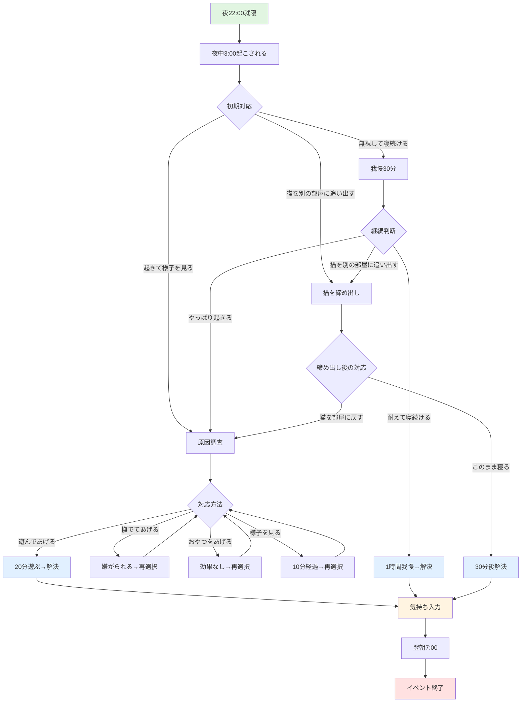

# シナリオ設計: 睡眠不足・夜間の鳴き声

## イベントツリー



## 1. 概要

### 対応する理由
- **No.1**: 睡眠不足・夜間の鳴き声（後悔理由で頻出）
- **分類**: 体験してみないとわからない × 後悔につながる
- **優先度**: 🔴 MVP必須（最優先領域）

### 目的
「本当に我慢できる？」を疑似体験で問う。夜泣きという**事実**を提示し、プレイヤー自身が「継続できるか」を判断する材料を提供する。

### 設計方針
- ❌ 「あなたは疲れました」のような説明的表現
- ⭕ 「夜中3時、猫が鳴いている、明日は9時から予定」という事実の提示
- ❌ 職種や個人の状況への直接言及
- ⭕ プレイヤーが自分の状況に置き換えられる表現
- ✅ 正解/不正解は存在しない（すべてトレードオフ）
- ✅ イベントは終わらない、結論も出さない
- ✅ 1週間体験 → 数ヶ月後を想起させる

### 夜泣きの原因（参考情報）

猫が夜中に鳴く原因は様々ですが、主に以下が考えられます：

- **遊び足りない・運動不足**（本シナリオで扱う）
- トイレが汚い
- 空腹・喉が渇いている
- 発情期（性的な鳴き）
- 病気・痛み
- 不安・寂しさ
- 認知症（高齢猫）

**MVP範囲**: 飼い主への「遊んでほしい」要求に絞って実装します。

---

## 2. 基本パラメータ

### 猫の設定
- **性格**: 固定（やや活発な一般的な子猫、生後3〜6ヶ月想定）
- **将来拡張**: 複数の性格パターンを追加検討

### 発生頻度
- **1週間で3回**（初日は確定発生）
- 2回目・3回目: 2日目〜7日目の間でランダム発生
- すべてのプレイヤーが必ず3回体験する（「余裕だ」を防ぐ）

### 発生タイミング
- **夜フェーズ**（22:00就寝後）
- 発生時刻: 深夜1:00〜4:00の間でランダム

---

## 3. イベントフロー

### 3-1. 初日（1日目）夜泣きイベント

#### フェーズ1: 就寝
```
【1日目・夜 22:00】

猫と過ごす最初の夜です。
猫は満足そうに眠っています。

あなたも眠ることにしました。

（自動進行）
```

#### フェーズ2: 夜中に起こされる
```
【夜中 3:00】

「ニャアアアア！ニャアアアア！」
（音声: 長く激しい鳴き声、5秒ループ）

猫が大声で鳴いています。
時計を見ると、3時です。

明日は朝9時から予定があります。

どうしますか？

1. 起きて様子を見る
2. 無視して寝続ける
3. 猫を別の部屋に追い出す
```

#### 分岐A: 起きて様子を見る

**ステップ1: 原因調査**
```
（あなたは起きて、猫の様子を確認しました）

猫は部屋の中を走り回っています。
トイレは綺麗です。ご飯も残っています。

（鳴き声は続いています）

どうしますか？

1. 遊んであげる
2. 撫でてあげる
3. おやつをあげる
4. もう少し様子を見る
```

**ステップ2-1: 遊んであげる**
```
（あなたは遊んであげることにしました）

猫は喜んで遊び始めました。
おもちゃを追いかけ回しています。

20分が経過しました。
猫は満足したようで、鳴き声が止まりました。

猫は眠り始めました。
```

**気持ち入力**
```
---

今、あなたはどんな気持ちですか？

😊 満足 ----●---- 😟 不満
🙂 余裕 ----●---- 😰 しんどい

（任意）他に感じたことがあれば自由に入力してください：
[                                          ]

（次へ）
```

**翌朝**
```
【2日目・朝 7:00】

目覚ましが鳴ります。

時計を見ると、7時です。
あなたは昨夜、結局4時間しか眠れませんでした。

今日は朝9時から予定があります。

（次へ）
```

**ステップ2-2: 撫でてあげる**
```
（あなたは撫でてあげることにしました）

猫は撫でられるのを嫌がり、逃げてしまいました。

（鳴き声は続いています）

どうしますか？

1. 遊んであげる
2. おやつをあげる
3. もう少し様子を見る
4. 諦めて寝る
```

（以下、選択肢に応じて分岐... ステップ2-1と同様の構造）

**ステップ2-3: おやつをあげる**
```
（あなたはおやつをあげることにしました）

猫はおやつを食べましたが、
すぐにまた鳴き始めました。

（鳴き声は続いています）

どうしますか？

1. 遊んであげる
2. もう少し様子を見る
3. 諦めて寝る
```

**ステップ2-4: もう少し様子を見る**
```
（あなたは様子を見ることにしました）

10分が経過しました。

（鳴き声は続いています）

どうしますか？

1. 遊んであげる
2. 撫でてあげる
3. おやつをあげる
4. 諦めて寝る
```

#### 分岐B: 無視して寝続ける

**ステップ1: 我慢**
```
（あなたは無視して寝続けることにしました）

「ニャアアアア！ニャアアアア！」
（音声: 鳴き声がさらに大きくなる、10秒ループ）

鳴き声はどんどん大きくなります。
壁の向こうから「ドン！ドン！」という音が聞こえました。

30分が経過しました。
鳴き声は止まりません。

どうしますか？

1. やっぱり起きて様子を見る
2. 耐えて寝続ける
3. 猫を別の部屋に追い出す
```

**ステップ2-1: やっぱり起きる**
```
（分岐Aの「起きて様子を見る」と同じフローに合流）
```

**ステップ2-2: 耐えて寝続ける**
```
（あなたは耐えて寝続けることにしました）

「ニャアアアア！ニャアアアア！」
（音声: 鳴き声は続く）

1時間が経過しました。
ようやく鳴き声が止まりました。

あなたは再び眠りにつきました。
```

**気持ち入力**
```
---

今、あなたはどんな気持ちですか？

😊 満足 ----●---- 😟 不満
🙂 余裕 ----●---- 😰 しんどい

（任意）他に感じたことがあれば自由に入力してください：
[                                          ]

（次へ）
```

**翌朝**
```
【2日目・朝 7:00】

目覚ましが鳴ります。

昨夜は途中で何度も起きてしまいました。
今日は朝9時から予定があります。

（次へ）
```

#### 分岐C: 猫を別の部屋に追い出す

**ステップ1: 締め出し**
```
（あなたは猫を別の部屋に追い出し、ドアを閉めました）

猫はドアを引っ掻いて鳴いています。

「ニャアアア...ニャアアア...」
（音声: 少し小さめの鳴き声、5秒ループ）

ドア越しに鳴き声が聞こえます。
猫はすばしっこく、締め出すのも一苦労でした。

どうしますか？

1. このまま寝る
2. やっぱり猫を部屋に戻す
```

**ステップ2-1: このまま寝る**
```
（あなたはこのまま寝ることにしました）

鳴き声は聞こえ続けていますが、
少しずつ小さくなっていきました。

30分後、鳴き声は止まりました。

あなたは眠りにつきました。
```

**気持ち入力**
```
（同様の気持ち入力UI）
```

**翌朝**
```
【2日目・朝 7:00】

目覚ましが鳴ります。

昨夜は猫を別の部屋に追い出して寝ました。
今日は朝9時から予定があります。

（次へ）
```

**ステップ2-2: やっぱり猫を部屋に戻す**
```
（分岐Aの「起きて様子を見る」と同じフローに合流）
```

---

### 3-2. 2回目・3回目の夜泣きイベント

**基本構造は初日と同じ**です。

- 発生タイミング: 2日目〜7日目の間でランダムに2回発生
- イベントフロー: 3-1と同一（原因は「遊び足りない」）
- バリエーション: 発生時刻、鳴き声の大きさ、継続時間に若干の違いを持たせる

**将来バージョン**: 他の原因（トイレ、発情期など）のバリエーションを追加検討

---

## 4. 終了時レポートでの振り返り

### プレイヤーの行動パターン別フィードバック

プレイヤーの選択に応じて、異なる視点を提示します。**すべてトレードオフであり、正解/不正解ではありません。**

**判定ロジック**: 3回の夜泣きイベントで、最も回数が多かった選択パターンで表示します。

#### パターン1: 「遊んであげる」が最多の場合

```
【あなたの選択】
夜中に猫が鳴いたとき、あなたは主に「遊んであげる」を選びました。

---

猫は遊んでもらえて幸せだったでしょう。

ただし、猫は「鳴けば遊んでもらえる」と学習します。
今後、夜泣きはさらに頻繁になる可能性があります。

あなたは、これを継続できそうですか？
```

#### パターン2: 「猫を別の部屋に追い出す」が最多の場合

```
【あなたの選択】
夜中に猫が鳴いたとき、あなたは主に「猫を別の部屋に追い出す」を選びました。

---

猫は諦めて、夜間は鳴かなくなるかもしれません。

ただし、猫は寂しさや不安を感じやすくなります。
また、猫はすばしっこいので、締め出すのも一苦労です。

あなたは、これを継続できそうですか？
```

#### パターン3: 「無視して寝る」が最多の場合

```
【あなたの選択】
夜中に猫が鳴いたとき、あなたは主に「無視して寝続ける」を選びました。

---

猫は諦めて、鳴きにくくなるかもしれません。

ただし、遊んでもらえないとストレスや肥満につながります。
日中にたくさん遊んであげるなど、別の工夫が必要になりそうです。

あなたは、これを継続できそうですか？
```

**注**: 同数の場合は、優先順位（パターン1 > パターン2 > パターン3）で表示します。

**将来拡張**: より細かいパターン分類や、複数パターンの組み合わせ表示を検討

### 統計データとの照合

```
---

実際の猫の飼育では、夜泣きが数ヶ月、数年続くことがあります。
特に子猫期（生後6ヶ月まで）は、夜泣きが頻繁に起こります。

「睡眠不足・夜間の鳴き声」は、後悔理由として頻繁に挙がります。
```

### プレイヤーの気持ちログの表示

```
【あなたの記録】

1日目夜:
- 選択: 遊んであげた
- 気持ち: 「しんどい」寄り、「かわいいけど眠い」

3日目夜:
- 選択: 無視して寝た
- 気持ち: 「不満」寄り、「近所迷惑が心配」

5日目夜:
- 選択: 別の部屋に追い出した
- 気持ち: 「余裕」寄り、「慣れてきた」

---

あなたの体験を振り返って、どう感じましたか？
```

---

## 5. 音声素材の要件

### 必要な音声ファイル

| 音声ID | 内容 | 長さ | 用途 |
|---|---|---|---|
| `meow_loud_loop.mp3` | 大声で激しい鳴き声 | 5秒（ループ） | 基本の夜泣き |
| `meow_louder_loop.mp3` | さらに大きな鳴き声 | 10秒（ループ） | 無視した場合 |
| `wall_knock.mp3` | 壁ドンの音 | 1秒 | 近隣トラブル示唆 |

### 素材探しの方針
- フリー素材サイト（効果音ラボ、DOVA-SYNDROME等）
- 「猫 鳴き声 夜」等のキーワードで検索
- リアリティ重視（かわいい鳴き声ではなく、実際の夜泣き音）

---

## 6. 成功基準

- ✅ すべてのプレイヤーが1週間で3回の夜泣きを体験
- ✅ 気持ちログの入力率: 60%以上
- ✅ 終了時アンケートで「夜泣きが印象に残った」: 70%以上
- ✅ 「継続性への不安を感じた」: 50%以上

---

## 7. 将来拡張案

### フェーズ2以降で検討
- 猫の性格バリエーション（おとなしい/やんちゃ/神経質）
- 成猫（1歳以上）のシナリオ（夜泣き頻度が下がる）
- 対処法の学習システム（知識を得ると対応しやすくなる）
- 近隣トラブルへの発展（苦情が来るイベント）

---

## 参考

- [41-対応すべき理由の整理.md](../../product/君はねこを飼えるか/41-対応すべき理由の整理.md): 統計データと優先順位
- [51-MVP必須機能一覧.md](../../product/君はねこを飼えるか/51-MVP必須機能一覧.md): MVP必須機能の全体像
