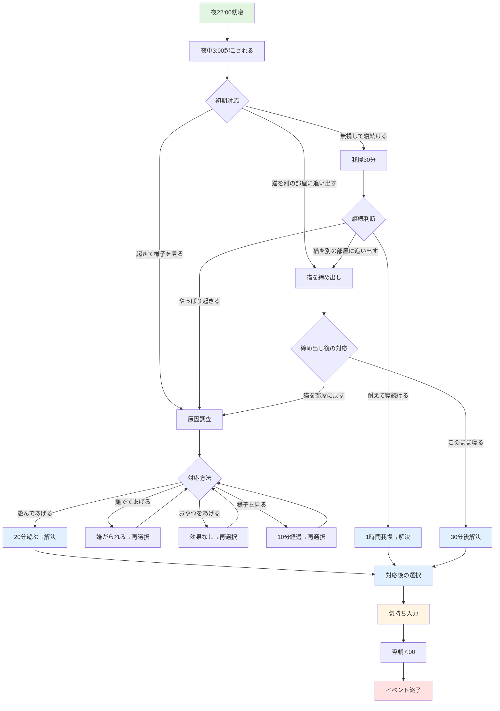

# シナリオ設計: 睡眠妨害（夜泣き・早朝起こし）

## 1. 概要

### 1.1 対応する理由

- **No.1**: 睡眠不足・夜間の鳴き声（後悔理由で頻出）
- **分類**: 体験してみないとわからない × 後悔につながる
- **優先度**: MVP必須（最優先領域）

### 1.2 統計的背景

| 調査 | 結果 |
|------|------|
| 猫飼い主の後悔率 | **36%** が「大変だった・後悔した」 |
| 睡眠不足経験率 | **68.7%** が「愛猫のせいで寝不足になった」 |
| 主な原因 | 夜中の運動会、早朝の鳴き声、慢性的な寝不足 |

> 出典: ねこのきもちWEBマガジン調査、猫の飼育放棄理由と後悔調査.md

### 1.3 目的

「本当に我慢できる？」を疑似体験で問う。睡眠妨害という**事実**を提示し、プレイヤー自身が「継続できるか」を判断する材料を提供する。

### 1.4 設計原則

| 原則 | NG例 | OK例 |
|------|------|------|
| 説明しない | 「あなたは疲れました」 | - |
| 事実を提示する | - | 「夜中3時、猫が鳴いている」 |
| 正解を提示しない | 「遊んであげましょう」 | すべてトレードオフ |
| 結論を出さない | 「飼うべきではない」 | 「継続できそうですか？」 |
| 感情を決めつけない | 「全然寝れてないな」「眠くてつらいな」 | 「ちょっと寝不足かも…。」 |

**補足: 感情表現について**

プレイヤーの感情を断定する表現は避けるが、**補助となるセリフ**（プレイヤーが自分の感情を投影しやすい曖昧な表現）は使用してよい。

```
❌ NG: 断定的な感情表現
- 「全然寝れてないな」
- 「眠くてつらいな」
- 「もう限界だ」

⭕ OK: 補助的なセリフ（曖昧・控えめ）
- 「ちょっと寝不足かも…。」
- 「なんだか眠いな…。」
- 「昨日は何時に寝たっけ…。」
```

---

## 2. 睡眠妨害体験の設計方針

### 2.1 体験の種類と違い

睡眠妨害は **夜泣き** と **早朝起こし** の2種類で構成する。

| 観点 | 夜泣き | 早朝起こし |
|------|--------|------------|
| **性質** | 突発的・割り込み | 習慣的・毎日起きやすい |
| **負荷** | 判断を迫られる | 睡眠時間が削られる |
| **感情** | 迷い・苛立ち | 諦め・慢性疲労 |
| **UI** | 複数の選択肢 | 選択肢は少ない、またはなし |
| **体験の核** | 「今どうするか」 | 「これが続く生活を受け入れられるか」 |

### 2.2 1週間という枠組み

睡眠妨害は **1日単位ではなく、1週間という時間軸** の中で体験させる。

```
1日だけ起こされる → 「イベント」
複数日にわたり断続的に起こされる → 「生活」
```

**配置方針**:
- 夜泣きと早朝起こしを **混在させる**
- 連続しすぎない日、何も起きない日も用意する
- 回復しきらない状態で次の睡眠妨害が来る日を作る

これにより「特別な事件は起きていないが、生活は確実に削られている」という感覚を生む。

### 2.3 夜泣きと早朝起こしの影響の違い

| 種別 | 睡眠時間への影響 | 体感 |
|------|------------------|------|
| **夜泣き** | 対応時間（15-30分）＋その後の入眠時間 | 「途中で起きた」ことが翌日に響く |
| **早朝起こし** | 直接削られる（1-2時間減） | 単純に睡眠時間が足りない |

**夜泣きの特徴**:
- 対応時間自体は15-30分程度
- しかし **対応後にすぐ眠れるかは人それぞれ**
- プレイヤー自身に「その後どうしたか」を選択させる

**早朝起こしの特徴**:
- 単純に睡眠時間が削られる（AM5時起床なら2時間減）
- 「もう一度寝る」ことが難しい時間帯
- 淡々と睡眠不足が積み重なる

---

## 3. 基本パラメータ

### 3.1 猫の設定

- **性格**: 固定（やや活発な一般的な子猫、生後3〜6ヶ月想定）
- **将来拡張**: 複数の性格パターンを追加検討

### 3.2 夜泣きの原因（参考情報）

猫が夜中に鳴く原因は様々ですが、主に以下が考えられます：

- **遊び足りない・運動不足**（本シナリオで扱う）
- トイレが汚い
- 空腹・喉が渇いている
- 発情期（性的な鳴き）
- 病気・痛み
- 不安・寂しさ
- 認知症（高齢猫）

**MVP範囲**: 飼い主への「遊んでほしい」要求に絞って実装します。

### 3.3 発生頻度と配置

| 日 | 夜泣き | 早朝起こし | 睡眠時間 | 備考 |
|----|--------|------------|----------|------|
| 1日目 | ✅ | - | 6〜7時間 | 初日は確定発生。対応後の選択で変動 |
| 2日目 | - | - | 7時間 | 回復日 |
| 3日目 | - | ✅ | 5時間 | 早朝5時に起こされる |
| 4日目 | ✅ | - | 5.5〜6.5時間 | 対応後の選択で変動 |
| 5日目 | - | ✅ | 5時間 | 早朝起こし |
| 6日目 | - | - | 7時間 | 回復日 |
| 7日目 | ✅ | - | 6〜7時間 | 最終日。対応後の選択で変動 |

**ポイント**:
- 夜泣き3回、早朝起こし2回（合計5回の睡眠妨害）
- 夜泣きの日は **プレイヤーの選択** によって睡眠時間が変動
- 早朝起こしの日は **睡眠時間** が直接削られる

---

## 4. 夜泣きイベントフロー

### 4.1 イベントツリー



### 4.2 フェーズ1: 就寝

```
【1日目・夜 22:00】

猫と過ごす最初の夜です。
猫は満足そうに眠っています。

あなたも眠ることにしました。

（自動進行）
```

### 4.3 フェーズ2: 夜中に起こされる

```
【夜中 3:00】

「ニャアアアア！ニャアアアア！」
（音声: 長く激しい鳴き声、5秒ループ）

猫が大声で鳴いています。
時計を見ると、3時です。

明日は朝9時から予定があります。

どうしますか？

1. 起きて様子を見る
2. 無視して寝続ける
3. 猫を別の部屋に追い出す
```

### 4.4 分岐A: 起きて様子を見る

**ステップ1: 原因調査**
```
（あなたは起きて、猫の様子を確認しました）

猫は部屋の中を走り回っています。
トイレは綺麗です。ご飯も残っています。

（鳴き声は続いています）

どうしますか？

1. 遊んであげる
2. 撫でてあげる
3. おやつをあげる
4. もう少し様子を見る
```

**ステップ2-1: 遊んであげる**
```
（あなたは遊んであげることにしました）

猫は喜んで遊び始めました。
おもちゃを追いかけ回しています。

20分が経過しました。
猫は満足したようで、鳴き声が止まりました。

猫は眠り始めました。
```

**ステップ2-2: 撫でてあげる**
```
（あなたは撫でてあげることにしました）

猫は撫でられるのを嫌がり、逃げてしまいました。

（鳴き声は続いています）

どうしますか？

1. 遊んであげる
2. おやつをあげる
3. もう少し様子を見る
4. 諦めて寝る
```

**ステップ2-3: おやつをあげる**
```
（あなたはおやつをあげることにしました）

猫はおやつを食べましたが、
すぐにまた鳴き始めました。

（鳴き声は続いています）

どうしますか？

1. 遊んであげる
2. もう少し様子を見る
3. 諦めて寝る
```

**ステップ2-4: もう少し様子を見る**
```
（あなたは様子を見ることにしました）

10分が経過しました。

（鳴き声は続いています）

どうしますか？

1. 遊んであげる
2. 撫でてあげる
3. おやつをあげる
4. 諦めて寝る
```

### 4.5 分岐B: 無視して寝続ける

**ステップ1: 我慢**
```
（あなたは無視して寝続けることにしました）

「ニャアアアア！ニャアアアア！」
（音声: 鳴き声がさらに大きくなる、10秒ループ）

鳴き声はどんどん大きくなります。
壁の向こうから「ドン！ドン！」という音が聞こえました。

30分が経過しました。
鳴き声は止まりません。

どうしますか？

1. やっぱり起きて様子を見る
2. 耐えて寝続ける
3. 猫を別の部屋に追い出す
```

**ステップ2-2: 耐えて寝続ける**
```
（あなたは耐えて寝続けることにしました）

「ニャアアアア！ニャアアアア！」
（音声: 鳴き声は続く）

1時間が経過しました。
ようやく鳴き声が止まりました。

あなたは再び眠りにつきました。
```

### 4.6 分岐C: 猫を別の部屋に追い出す

**ステップ1: 締め出し**
```
（あなたは猫を別の部屋に追い出し、ドアを閉めました）

猫はドアを引っ掻いて鳴いています。

「ニャアアア...ニャアアア...」
（音声: 少し小さめの鳴き声、5秒ループ）

ドア越しに鳴き声が聞こえます。
猫はすばしっこく、締め出すのも一苦労でした。

どうしますか？

1. このまま寝る
2. やっぱり猫を部屋に戻す
```

**ステップ2-1: このまま寝る**
```
（あなたはこのまま寝ることにしました）

鳴き声は聞こえ続けていますが、
少しずつ小さくなっていきました。

30分後、鳴き声は止まりました。

あなたは眠りにつきました。
```

### 4.7 夜泣き対応後の選択肢

夜泣きイベント終了後、プレイヤーに「その後どうしたか」を選ばせる。

```
猫は眠りにつきました。
あなたはどうしますか？

1. すぐに寝る
2. なかなか寝付けない…
3. 少しスマホをいじってから寝よう
```

| 選択肢 | 追加の睡眠ロス | 翌朝メッセージ例 |
|--------|----------------|------------------|
| すぐに寝る | なし | 「昨夜は途中で起きてしまいました。」 |
| なかなか寝付けない… | 30分〜1時間 | 「昨夜は途中で起きて、なかなか眠れませんでした。」 |
| 少しスマホをいじってから寝よう | 30分〜1時間 | 「昨夜は途中で起きて、少しスマホを見てから寝ました。」 |

### 4.8 気持ち入力

```
---

今、あなたはどんな気持ちですか？

😊 満足 ----●---- 😟 不満
🙂 余裕 ----●---- 😰 しんどい

（任意）他に感じたことがあれば自由に入力してください：
[                                          ]

（次へ）
```

### 4.9 翌朝メッセージ

夜泣きと対応後の選択に応じてメッセージを変える：

```
【夜泣きの翌朝（すぐ寝た場合）】
昨夜は途中で起きてしまいました。
ちょっと寝不足かも…。

【夜泣きの翌朝（寝付けなかった場合）】
昨夜は途中で起きて、なかなか眠れませんでした。
なんだか眠いな…。
```

---

## 5. 早朝起こしイベントフロー

### 5.1 目的

**判断よりも「削られる生活」を体験させる**

- イベント感は弱くする
- 選択肢は最小限、もしくは存在しない
- 淡々と睡眠時間が短くなる事実を提示する

### 5.2 体験イメージ

```
【AM 4:58】

「ニャー、ニャー」

猫が枕元で鳴いています。

（操作なし・自動進行）

---

【AM 7:00】

目覚ましが鳴ります。

今日は5時間しか眠れませんでした。
なんだか眠いな…。
```

### 5.3 設計ポイント

| ポイント | 説明 |
|----------|------|
| **選択肢なし** | 「起こされた」という事実のみ |
| **時間の淡々とした提示** | AM 4:58 → AM 7:00 |
| **睡眠時間の累積表示** | 「今日は○時間しか眠れなかった」 |
| **回復できない感覚** | 前日の疲労が残った状態で次の日へ |

---

## 6. 終了時レポートでの振り返り

### 6.1 週の統計

評価や断定は行わず、**事実の集積のみを提示**する。

```
【1週間の記録】

夜中に起こされた回数: 3回
早朝に起こされた回数: 2回
平均睡眠時間: 約6時間

---

あなたは、この生活を
来週も続けられそうですか？
```

### 6.2 プレイヤーの行動パターン別フィードバック

プレイヤーの選択に応じて、異なる視点を提示します。**すべてトレードオフであり、正解/不正解ではありません。**

**判定ロジック**: 3回の夜泣きイベントで、最も回数が多かった選択パターンで表示します。

#### パターン1: 「遊んであげる」が最多の場合

```
【あなたの選択】
夜中に猫が鳴いたとき、あなたは主に「遊んであげる」を選びました。

---

猫は遊んでもらえて幸せだったでしょう。

ただし、猫は「鳴けば遊んでもらえる」と学習します。
今後、夜泣きはさらに頻繁になる可能性があります。

あなたは、これを継続できそうですか？
```

#### パターン2: 「猫を別の部屋に追い出す」が最多の場合

```
【あなたの選択】
夜中に猫が鳴いたとき、あなたは主に「猫を別の部屋に追い出す」を選びました。

---

猫は諦めて、夜間は鳴かなくなるかもしれません。

ただし、猫は寂しさや不安を感じやすくなります。
また、猫はすばしっこいので、締め出すのも一苦労です。

あなたは、これを継続できそうですか？
```

#### パターン3: 「無視して寝る」が最多の場合

```
【あなたの選択】
夜中に猫が鳴いたとき、あなたは主に「無視して寝続ける」を選びました。

---

猫は諦めて、鳴きにくくなるかもしれません。

ただし、遊んでもらえないとストレスや肥満につながります。
日中にたくさん遊んであげるなど、別の工夫が必要になりそうです。

あなたは、これを継続できそうですか？
```

**注**: 同数の場合は、優先順位（パターン1 > パターン2 > パターン3）で表示します。

### 6.3 プレイヤーの気持ちログの表示

```
【あなたの記録】

1日目夜:
- 選択: 遊んであげた
- 気持ち: 「しんどい」寄り、「かわいいけど眠い」

3日目朝:
- 早朝起こし
- 睡眠時間: 5時間

4日目夜:
- 選択: 無視して寝た
- 気持ち: 「不満」寄り、「近所迷惑が心配」

---

あなたの体験を振り返って、どう感じましたか？
```

### 6.4 統計データとの照合

```
---

実際の猫の飼育では、夜泣きが数ヶ月、数年続くことがあります。
特に子猫期（生後6ヶ月まで）は、夜泣きが頻繁に起こります。

「睡眠不足・夜間の鳴き声」は、後悔理由として頻繁に挙がります。
```

---

## 7. 音声素材の要件

### 7.1 必要な音声ファイル

| 音声ID | 内容 | 長さ | 用途 |
|--------|------|------|------|
| `meow_loud_loop.mp3` | 大声で激しい鳴き声 | 5秒（ループ） | 基本の夜泣き |
| `meow_louder_loop.mp3` | さらに大きな鳴き声 | 10秒（ループ） | 無視した場合 |
| `meow_morning.mp3` | 朝の鳴き声 | 3秒 | 早朝起こし |
| `wall_knock.mp3` | 壁ドンの音 | 1秒 | 近隣トラブル示唆 |

### 7.2 素材探しの方針

- フリー素材サイト（効果音ラボ、DOVA-SYNDROME等）
- 「猫 鳴き声 夜」等のキーワードで検索
- リアリティ重視（かわいい鳴き声ではなく、実際の夜泣き音）

---

## 8. 成功基準

- すべてのプレイヤーが1週間で5回の睡眠妨害を体験（夜泣き3回 + 早朝起こし2回）
- 気持ちログの入力率: 60%以上
- 終了時アンケートで「睡眠妨害が印象に残った」: 70%以上
- 「継続性への不安を感じた」: 50%以上

---

## 9. 将来拡張案

### フェーズ2以降で検討

- 猫の性格バリエーション（おとなしい/やんちゃ/神経質）
- 成猫（1歳以上）のシナリオ（夜泣き頻度が下がる）
- 対処法の学習システム（知識を得ると対応しやすくなる）
- 近隣トラブルへの発展（苦情が来るイベント）
- 他の原因（トイレ、発情期など）のバリエーション

---

## 参考

- [猫の飼育放棄理由と後悔調査.md](./猫の飼育放棄理由と後悔調査.md): 統計データと参考情報
- [nightcry-scenario-analysis.md](../../work/nightcry-scenario-analysis.md): 調査・分析レポート
