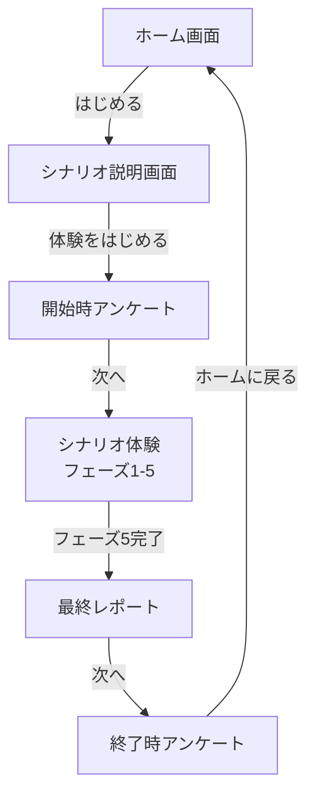

# MVP 画面設計

## 概要

MVP で必要な画面とその設計を定義する。

### 画面遷移図



### 各遷移のトリガー

| 遷移 | トリガー |
|------|----------|
| ホーム → シナリオ説明 | 「はじめる」ボタン |
| シナリオ説明 → 開始時アンケート | 「体験をはじめる」ボタン |
| 開始時アンケート → シナリオ体験 | 「次へ」ボタン（質問1回答後） |
| シナリオ体験 → 最終レポート | フェーズ5完了後、自動遷移 |
| 最終レポート → 終了時アンケート | 「次へ」ボタン |
| 終了時アンケート → ホーム | 「ホームに戻る」ボタン |

---

## 1. ホーム画面

### 1.1 役割

- プロダクトのコンセプトを伝える
- ターゲットユーザーが「自分に必要だ」と感じられるようにする
- シナリオ体験への導線

### 1.2 決めるべきこと

- [ ] キャッチコピー / タイトル表示
- [ ] コンセプト説明文
- [ ] ターゲットへの呼びかけ
- [ ] CTA（行動喚起）ボタンの文言
- [ ] ビジュアル要素（あれば）

### 1.3 設計

#### レイアウト

```
┌─────────────────────────────┐
│                             │
│   君はねこを飼えるか？        │
│   ─────────────────         │
│   飼う前に、猫を知ろう        │
│                             │
│   [猫のイラスト]             │
│                             │
│   猫を飼うか迷っていますか？   │
│                             │
│   夜中の鳴き声、突然の病院代、 │
│   毎日のお世話——             │
│   飼ってから気づく日常を、    │
│   ここで体験してみてください。 │
│                             │
│   飼った後に後悔しないために。 │
│                             │
│        [はじめる]            │
│                             │
└─────────────────────────────┘
```

#### 各要素

| 要素 | 内容 |
|------|------|
| タイトル | 君はねこを飼えるか？ |
| タグライン | 飼う前に、猫を知ろう |
| コンセプト | 猫を飼うか迷っていますか？<br>夜中の鳴き声、突然の病院代、毎日のお世話——<br>飼ってから気づく日常を、ここで体験してみてください。 |
| 強調メッセージ | **飼った後に後悔しないために。** |
| CTA | はじめる |
| ビジュアル | 猫のイラスト（かわいすぎない、リアル寄り） |

---

## 2. シナリオ説明画面

### 2.1 役割

- これから何を体験するか説明する
- 心構えを作る

### 2.2 決めるべきこと

- [ ] シナリオのタイトル / テーマ
- [ ] 体験の概要説明
- [ ] 所要時間の目安
- [ ] 注意事項（あれば）

### 2.3 設計

#### レイアウト

```
┌─────────────────────────────┐
│                             │
│   夜泣き・睡眠不足           │
│   ─────────────────         │
│   ある飼い主の体験           │
│                             │
│   あなたは架空の猫の飼い主として、│
│   日常を体験します。         │
│                             │
│   猫を迎えて数週間。         │
│   ある夜、鳴き声で目が覚めた——│
│                             │
│   この体験では、夜泣きによる  │
│   睡眠不足がどのように       │
│   日常に影響するかを体験します。│
│                             │
│   所要時間：約5〜10分        │
│                             │
│   ※ 音声が流れます          │
│                             │
│     [体験をはじめる]         │
│                             │
└─────────────────────────────┘
```

#### 各要素

| 要素 | 内容 |
|------|------|
| タイトル | 夜泣き・睡眠不足 |
| サブタイトル | ある飼い主の体験 |
| 体験の前提 | **あなたは架空の猫の飼い主として、日常を体験します。** |
| 概要 | 猫を迎えて数週間。<br>ある夜、鳴き声で目が覚めた——<br><br>この体験では、夜泣きによる睡眠不足がどのように日常に影響するかを体験します。 |
| 所要時間 | 約5〜10分 |
| 注意事項 | ※ 音声が流れます |
| CTA | 体験をはじめる |

---

## 3. 開始時アンケート

### 3.1 役割

- 効果測定のベースライン取得
- ユーザーの現状把握

### 3.2 決めるべきこと

- [ ] 質問数（最小限）
- [ ] 各質問の内容と選択肢
- [ ] 必須 / 任意の区分

### 3.3 設計

#### 質問1（必須）

> 今、猫を飼いたいと思っていますか？

| 選択肢 |
|--------|
| とても飼いたい |
| やや飼いたい |
| 迷っている |
| あまり飼いたくない |
| 飼うつもりはない |

#### 質問2（任意・複数選択可）

> この体験に期待することは？（複数選択可）

| 選択肢 |
|--------|
| 飼育の大変さを知りたい |
| 猫との生活をイメージしたい |
| 飼う前に気づきを得たい |
| その他（自由記述） |

#### 設計意図

| 質問 | 目的 |
|------|------|
| 質問1 | 行動変容率の測定（終了時と比較） |
| 質問2 | ユーザーの期待把握、プロダクト改善のヒント |

---

## 4. 終了時アンケート

### 4.1 役割

- 行動変容の測定
- 気づきの確認

### 4.2 決めるべきこと

- [ ] 質問数（最小限）
- [ ] 各質問の内容と選択肢
- [ ] 開始時との比較項目

### 4.3 設計

#### 質問1（必須）

> 今、猫を飼いたいと思っていますか？

| 選択肢 |
|--------|
| とても飼いたい |
| やや飼いたい |
| 迷っている |
| あまり飼いたくない |
| 飼うつもりはない |

#### 質問2（必須）

> この体験で気づきはありましたか？

| 選択肢 |
|--------|
| 新しい気づきがあった |
| 知っていたが、実感できた |
| 特に気づきはなかった |

#### 質問3（任意・自由記述）

> 気づいたことや感想があれば教えてください

（自由記述）

#### 設計意図

| 質問 | 目的 | 対応する定量目標 |
|------|------|------------------|
| 質問1 | 開始時との差分で変化を測定 | 行動変容率 |
| 質問2 | 気づきの有無を定量化 | ユーザー満足度 |
| 質問3 | 定性フィードバック収集 | プロダクト改善 |

