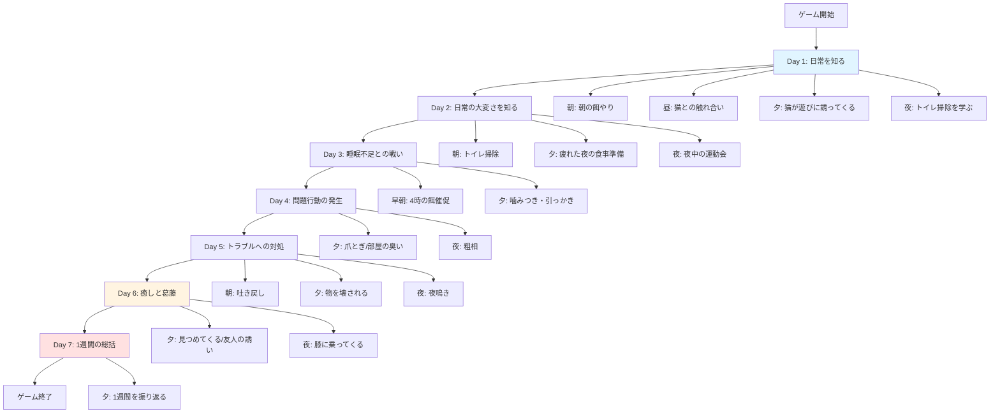

# シナリオ設計

## 概要

本ドキュメントでは、「君はねこを飼えるか？」で実装するシナリオの詳細を定義します。機能一覧.mdの「2. コアゲームプレイ機能」をベースに、テキストベースで実装可能なシナリオを整理します。

---

## シナリオ設計の原則

### 基本方針

1. **静的シナリオ**: すべてのユーザーが同じイベントを同じタイミングで体験
2. **ターン制**: シナリオに応じた時間単位で進行（リアルタイムではない）
3. **ゲームオーバーなし**: 状態が悪化するだけで、最後まで体験させる
4. **イベント発生頻度**: ネガティブ:ポジティブ = 6:4

### シナリオ構成

- **MVP版**: 1週間の飼育体験（7日間 × 朝昼夕夜 = 28ターン想定）
- **将来版**: 1ヶ月の飼育体験（選択制）

---

## MVP版シナリオ構成

### 全体フロー（1週間版）



### 7日間の詳細構成

```
Day 1 (導入): 日常を知る
  - 朝: 朝の餌やり
  - 昼: 猫との触れ合い
  - 夕: 猫が遊びに誘ってくる
  - 夜: トイレ掃除を学ぶ

Day 2-3 (日常の大変さ): 基本的なお世話の継続性
  - 朝: 睡眠不足との戦い
  - 昼: トイレ掃除の継続
  - 夕: 疲れた夜の食事準備
  - 夜: 夜中の運動会

Day 4-5 (問題行動): 想定外のトラブル
  - 粗相イベント
  - 家具へのダメージ
  - 吐き戻し
  - 噛みつき・引っかき

Day 6 (癒しと葛藤): ポジティブ体験
  - 猫が膝に乗ってくる
  - 猫が遊びに誘ってくる
  - 友人の誘いを断る（生活の自由度）

Day 7 (総括): 1週間を振り返る
  - 来客イベント（衛生面の現実）
  - 最終判断を問う
```

---

## イベント詳細設計

### カテゴリ1: 日常のお世話の継続性（2-2-1）

#### イベント1-1: 朝の餌やり（最優先）

**タイミング**: Day 1 朝

**シーン**:
```
朝6時、猫が「にゃーにゃー」と鳴きながらあなたのベッドに乗ってきました。
お腹を空かせているようです。
```

**選択肢**:
1. 起きて餌をやる
2. もう少し寝る（無視する）

**結果**:

選択肢1:
```
猫は嬉しそうに餌を食べました。
あなたはそのまま支度を始めましたが、少し眠そうです。

変化:
- なつき度: +10
- 空腹度: -40
```

選択肢2:
```
猫はさらに大きな声で鳴き続けます。
結局30分後に起きて餌をやることになりました。
猫は少し不機嫌そうです。

変化:
- なつき度: -5
- ストレス度: +15
- 空腹度: -30
```

**実装状態**: ✅ プロトタイプで実装済み

---

#### イベント1-2: トイレ掃除（最優先）

**タイミング**: Day 2 朝

**シーン**:
```
出勤前、猫のトイレを見ると、排泄物がたまっています。
掃除しないと部屋が臭くなりそうですが、もう家を出る時間です。
```

**選択肢**:
1. 遅刻覚悟で掃除する
2. 帰宅後に掃除する（サボる）

**結果**:

選択肢1:
```
トイレをきれいにしました。猫も快適そうです。
会社には5分遅刻しました。

変化:
- なつき度: +5
- ストレス度: -10
```

選択肢2:
```
トイレをそのままにして出勤しました。
夕方帰宅すると、部屋中が臭います…
猫もストレスを感じているようです。

変化:
- ストレス度: +20
- 健康度: -5
```

**実装状態**: ✅ プロトタイプで実装済み

---

#### イベント1-3: 疲れた夜の食事準備

**タイミング**: Day 3 夕

**シーン**:
```
仕事で疲れて帰宅しました。
猫は餌を催促していますが、今日はドライフードだけにしたい気分です。
```

**選択肢**:
1. 手抜きでドライフードだけ
2. ウェットフードも用意

**結果**:

選択肢1:
```
猫はドライフードを食べましたが、少し不満そうです。

変化:
- なつき度: -3
- 空腹度: -30
```

選択肢2:
```
猫は嬉しそうにウェットフードを食べました。
あなたは少し疲れが増しましたが、猫の喜ぶ顔を見て癒されました。

変化:
- なつき度: +8
- 空腹度: -40
```

**実装状態**: 🟡 未実装

---

### カテゴリ2: 睡眠への影響（2-2-2）

#### イベント2-1: 夜中の運動会

**タイミング**: Day 2 夜

**シーン**:
```
深夜2時、猫が部屋中を走り回る音で目が覚めました。
「ドタドタドタ…」という足音が続きます。
明日は朝早くから大事な会議があるのに…
```

**選択肢**:
1. 諦めて耳栓をして寝る
2. 猫を捕まえて落ち着かせる
3. 遊んで疲れさせる

**結果**:

選択肢1:
```
耳栓をして何とか眠りにつきましたが、翌朝はぼんやりしています。

変化:
- プレイヤー体力: -15
```

選択肢2:
```
猫を捕まえましたが、すぐにまた走り出しました。
結局1時間ほど睡眠を失いました。

変化:
- プレイヤー体力: -20
- ストレス度: +5
```

選択肢3:
```
猫じゃらしで30分遊んだところ、猫は疲れて寝ました。
あなたも疲れましたが、猫は満足そうです。

変化:
- なつき度: +10
- ストレス度: -10
- プレイヤー体力: -25
```

**実装状態**: 🟡 未実装

---

#### イベント2-2: 早朝4時の餌催促

**タイミング**: Day 3 夜（早朝）

**シーン**:
```
朝4時、猫が「ニャーニャー」と鳴きながらあなたの顔を前足で叩いています。
お腹が空いたようです。まだ寝ていたいのに…
```

**選択肢**:
1. 無視して寝る
2. 起きて餌をやる

**結果**:

選択肢1:
```
猫はさらに大きな声で鳴き続け、結局眠れませんでした。
朝6時にやっと諦めて餌をやりました。

変化:
- なつき度: -8
- ストレス度: +15
- プレイヤー体力: -20
- 空腹度: -30
```

選択肢2:
```
眠い目をこすりながら餌をやりました。
猫は満足そうに食べていますが、あなたはもう眠れません。

変化:
- なつき度: +5
- プレイヤー体力: -15
- 空腹度: -40
```

**実装状態**: 🟡 未実装

---

### カテゴリ3: 衛生面の現実（2-2-3）

#### イベント3-1: 部屋の臭い

**タイミング**: Day 4 夕

**シーン**:
```
数日トイレ掃除をサボっていたら、部屋中が臭います。
今日は友人が遊びに来る予定です。
```

**選択肢**:
1. 友人に正直に話して延期してもらう
2. 急いで掃除する
3. 芳香剤でごまかす

**結果**:

選択肢1:
```
友人は理解してくれましたが、少し恥ずかしい気持ちになりました。

変化:
- ストレス度: -20（掃除したため）
```

選択肢2:
```
急いで掃除しましたが、完全には臭いが取れません。
友人は気を使って何も言いませんでした。

変化:
- ストレス度: -15
- プレイヤー体力: -10
```

選択肢3:
```
芳香剤と猫のトイレの臭いが混ざって、さらにひどくなりました。
友人は顔をしかめていました。

変化:
- ストレス度: +5（猫が芳香剤を嫌がる）
```

**実装状態**: 🟡 未実装

---

#### イベント3-2: 吐き戻し

**タイミング**: Day 5 朝

**シーン**:
```
朝起きたら、カーペットに猫の吐き戻しがありました。
毛玉を吐いたようです。急いで出勤しなければならないのに…
```

**選択肢**:
1. 掃除する（遅刻覚悟）
2. 後で掃除する

**結果**:

選択肢1:
```
カーペットをきれいにしました。
会社には10分遅刻しました。

変化:
- ストレス度: -5（猫が快適）
```

選択肢2:
```
そのまま出勤しました。
帰宅したら、吐き戻しが乾いてカーペットにシミができていました。

変化:
- ストレス度: +10
- 健康度: -3（猫がストレス）
```

**実装状態**: 🟡 未実装

---

### カテゴリ4: 家具・物への被害（2-2-4）

#### イベント4-1: 爪とぎ

**タイミング**: Day 4 夕

**シーン**:
```
帰宅すると、大切なソファが爪でボロボロになっていました。
猫は何食わぬ顔でこちらを見ています。
```

**選択肢**:
1. 我慢する
2. 爪とぎグッズを買う（費用3,000円）
3. 猫を叱る

**結果**:

選択肢1:
```
ソファは諦めました。
猫は今日も元気に爪とぎを続けています。

変化:
- なつき度: 変化なし
- 累積費用: +0円（ただしソファ買い替え将来必要）
```

選択肢2:
```
爪とぎグッズを買ってきました。
猫は少しずつそちらで爪をとぐようになりました。

変化:
- ストレス度: -10
- 累積費用: +3,000円
```

選択肢3:
```
猫を叱りましたが、猫は理解していないようです。
むしろ怖がってあなたから距離を取るようになりました。

変化:
- なつき度: -15
- ストレス度: +10
```

**実装状態**: 🟡 未実装

---

#### イベント4-2: 物を壊される

**タイミング**: Day 5 夜

**シーン**:
```
猫が棚に飛び乗ろうとして、花瓶を落としました。
ガシャーン！お気に入りの花瓶が割れてしまいました。
```

**選択肢**:
1. 諦めて片付ける
2. 猫を叱る

**結果**:

選択肢1:
```
ため息をつきながら片付けました。
猫はバツが悪そうにしています。

変化:
- なつき度: -3
```

選択肢2:
```
猫を叱りましたが、猫は何が悪いのか理解していません。
猫はあなたを避けるようになりました。

変化:
- なつき度: -10
- ストレス度: +15
```

**実装状態**: 🟡 未実装

---

### カテゴリ5: 生活の自由度への影響（2-2-5）

#### イベント5-1: 友人の誘い

**タイミング**: Day 6 夕

**シーン**:
```
友人から電話がかかってきました。
「今日飲みに行かない？久しぶりに会いたいな」
でも、猫に夕飯をあげる時間です。
```

**選択肢**:
1. 断る
2. ペットシッターを頼む（費用5,000円）
3. 行く（猫のストレス↑）

**結果**:

選択肢1:
```
友人に謝って断りました。
猫は嬉しそうにあなたに甘えてきます。

変化:
- なつき度: +10
- ストレス度: -10
```

選択肢2:
```
急いでペットシッターを手配しました。
友人と楽しい時間を過ごせましたが、出費が痛いです。

変化:
- 累積費用: +5,000円
```

選択肢3:
```
猫に多めに餌を置いて出かけました。
帰宅したら、猫は不機嫌そうにしています。

変化:
- なつき度: -10
- ストレス度: +20
- 空腹度: -40
```

**実装状態**: 🟡 未実装

---

### カテゴリ6: 問題行動のリアル（2-2-6）🔴 最優先

#### イベント6-1: 粗相（トイレ以外での排泄）

**タイミング**: Day 4 夜

**シーン**:
```
帰宅すると、猫がトイレではなくベッドの上で排泄していました。
トイレが汚れていたストレスが原因かもしれません。
```

**選択肢**:
1. 怒る（逆効果）
2. 獣医に相談（費用5,000円）
3. 環境を見直す

**結果**:

選択肢1:
```
猫を怒りましたが、猫はさらにストレスを感じています。
粗相が悪化する可能性があります。

変化:
- なつき度: -15
- ストレス度: +25
```

選択肢2:
```
獣医に相談したところ、ストレスが原因だと教えてもらいました。
トイレをこまめに掃除するようアドバイスされました。

変化:
- ストレス度: -10（適切な対処）
- 累積費用: +5,000円
```

選択肢3:
```
トイレを増やし、こまめに掃除するようにしました。
猫は少しずつ落ち着いてきました。

変化:
- ストレス度: -15
- 累積費用: +3,000円（トイレ追加）
```

**実装状態**: 🟡 未実装

---

#### イベント6-2: 夜鳴き

**タイミング**: Day 5 夜

**シーン**:
```
深夜、猫が「ニャーオ！ニャーオ！」と大きな声で鳴き続けています。
隣の部屋から壁を叩く音が聞こえました。苦情が来そうです。
```

**選択肢**:
1. 我慢する
2. 防音対策を検討（費用10,000円）
3. 原因を調べる

**結果**:

選択肢1:
```
翌日、隣人から苦情が来ました。
「夜中うるさいんですけど…」

変化:
- ストレス度: +20（猫・飼い主とも）
```

選択肢2:
```
防音カーテンと防音マットを購入しました。
少しましになりましたが、完全には防げません。

変化:
- ストレス度: -5
- 累積費用: +10,000円
```

選択肢3:
```
獣医に相談したところ、発情期の可能性があると教えてもらいました。
不妊手術を勧められました。

変化:
- ストレス度: -10（理解できた）
```

**実装状態**: 🟡 未実装

---

#### イベント6-3: 噛みつき・引っかき

**タイミング**: Day 3 夕

**シーン**:
```
猫と遊んでいたら、急に噛みつかれました。
手から血が出ています。遊びの延長なのか、ストレスなのか…
```

**選択肢**:
1. 叱る
2. 遊び方を変える
3. 獣医に相談（費用5,000円）

**結果**:

選択肢1:
```
猫を叱りましたが、猫は怖がって逃げてしまいました。
猫はあなたを避けるようになりました。

変化:
- なつき度: -15
- ストレス度: +15
```

選択肢2:
```
おもちゃを使って遊ぶようにしました。
直接手で遊ばないことで、噛みつきが減りました。

変化:
- なつき度: +5
- ストレス度: -10
```

選択肢3:
```
獣医に相談したところ、遊び方を変えるようアドバイスされました。
また、ストレスサインの見方も教えてもらいました。

変化:
- ストレス度: -15
- 累積費用: +5,000円
```

**実装状態**: 🟡 未実装

---

### カテゴリ7: ポジティブな側面（2-5-5）🔴 MVP必須

#### イベント7-1: 猫があなたを見つめてくる

**タイミング**: Day 6 夕

**シーン**:
```
ソファに座っていると、猫がじっとあなたを見つめています。
目が合うと、ゆっくり瞬きをしました。これは猫の「愛情表現」だそうです。
```

**選択肢**:
1. 同じように瞬きを返す
2. 撫でてあげる

**結果**:

選択肢1:
```
猫は嬉しそうにゴロゴロと喉を鳴らしました。
あなたも癒されました。

変化:
- なつき度: +10
- プレイヤー体力: +5
```

選択肢2:
```
猫は気持ちよさそうに目を細めています。
あなたも穏やかな気持ちになりました。

変化:
- なつき度: +12
- ストレス度: -5
- プレイヤー体力: +5
```

**実装状態**: 🟡 未実装

---

#### イベント7-2: 猫が膝に乗ってくる

**タイミング**: Day 6 夜

**シーン**:
```
本を読んでいると、猫が膝に乗ってきました。
重いけど、温かくて気持ちいいです。ゴロゴロと喉を鳴らしています。
```

**選択肢**:
1. そのまま撫で続ける
2. 写真を撮る

**結果**:

選択肢1:
```
猫はそのまま寝てしまいました。
あなたも幸せな気持ちで時間を過ごしました。

変化:
- なつき度: +15
- ストレス度: -10
- プレイヤー体力: +10
```

選択肢2:
```
スマホを取り出して写真を撮りました。
猫は少し動いてしまいましたが、可愛い写真が撮れました。

変化:
- なつき度: +8
- プレイヤー体力: +5
```

**実装状態**: 🟡 未実装

---

#### イベント7-3: 猫が遊びに誘ってくる

**タイミング**: Day 1 夕（プロトタイプで実装済み）

**シーン**:
```
帰宅後、疲れているあなたを猫が見つめています。
おもちゃを持ってきて、遊んでほしそうにしています。
```

**選択肢**:
1. 一緒に遊ぶ（30分）
2. 疲れているので今日は遊ばない

**結果**:

選択肢1:
```
猫じゃらしで30分遊びました。
猫は大満足で、あなたに甘えてきます。
あなたも少し癒されました。

変化:
- なつき度: +15
- ストレス度: -20
```

選択肢2:
```
猫を無視してソファに座りました。
猫は少し寂しそうにしています。

変化:
- なつき度: -10
- ストレス度: +10
```

**実装状態**: ✅ プロトタイプで実装済み

---

## MVP版シナリオ全体構成（1週間版）

### Day 1: 日常を知る

| 時間帯 | イベント | カテゴリ |
|--------|----------|---------|
| 朝 | 朝の餌やり（イベント1-1） | 日常のお世話 |
| 昼 | （導入イベント：猫との触れ合い） | ポジティブ |
| 夕 | 猫が遊びに誘ってくる（イベント7-3） | ポジティブ |
| 夜 | トイレ掃除の方法を学ぶ | 日常のお世話 |

### Day 2: 日常の大変さを知る

| 時間帯 | イベント | カテゴリ |
|--------|----------|---------|
| 朝 | トイレ掃除（イベント1-2） | 日常のお世話 |
| 昼 | （仕事中・イベントなし） | - |
| 夕 | 疲れた夜の食事準備（イベント1-3） | 日常のお世話 |
| 夜 | 夜中の運動会（イベント2-1） | 睡眠への影響 |

### Day 3: 睡眠不足との戦い

| 時間帯 | イベント | カテゴリ |
|--------|----------|---------|
| 早朝 | 早朝4時の餌催促（イベント2-2） | 睡眠への影響 |
| 昼 | （仕事中・イベントなし） | - |
| 夕 | 噛みつき・引っかき（イベント6-3） | 問題行動 |
| 夜 | （休息） | - |

### Day 4: 問題行動の発生

| 時間帯 | イベント | カテゴリ |
|--------|----------|---------|
| 朝 | （通常のお世話） | - |
| 昼 | （仕事中・イベントなし） | - |
| 夕 | 爪とぎ（イベント4-1）、部屋の臭い（イベント3-1） | 家具被害、衛生面 |
| 夜 | 粗相（イベント6-1） | 問題行動 |

### Day 5: トラブルへの対処

| 時間帯 | イベント | カテゴリ |
|--------|----------|---------|
| 朝 | 吐き戻し（イベント3-2） | 衛生面 |
| 昼 | （仕事中・イベントなし） | - |
| 夕 | 物を壊される（イベント4-2） | 家具被害 |
| 夜 | 夜鳴き（イベント6-2） | 問題行動 |

### Day 6: 癒しと葛藤

| 時間帯 | イベント | カテゴリ |
|--------|----------|---------|
| 朝 | （通常のお世話） | - |
| 昼 | （仕事中・イベントなし） | - |
| 夕 | 猫があなたを見つめてくる（イベント7-1）、友人の誘い（イベント5-1） | ポジティブ、生活の自由度 |
| 夜 | 猫が膝に乗ってくる（イベント7-2） | ポジティブ |

### Day 7: 1週間の総括

| 時間帯 | イベント | カテゴリ |
|--------|----------|---------|
| 朝 | （通常のお世話） | - |
| 昼 | （来客イベント・衛生面の確認） | 衛生面 |
| 夕 | 1週間を振り返る（最終判断） | 総括 |
| 夜 | ゲーム終了 | - |

---

## イベント発生頻度の検証

### カテゴリ別集計

| カテゴリ | イベント数 | 割合 |
|---------|-----------|------|
| ネガティブ合計 | 13 | 65% |
| - 日常のお世話 | 3 | 15% |
| - 睡眠への影響 | 2 | 10% |
| - 衛生面 | 2 | 10% |
| - 家具被害 | 2 | 10% |
| - 問題行動 | 3 | 15% |
| - 生活の自由度 | 1 | 5% |
| ポジティブ合計 | 3 | 15% |
| その他（導入・総括） | 4 | 20% |

**ネガティブ:ポジティブ = 13:3 ≒ 4.3:1**

⚠️ **調整が必要**: 目標は 6:4 だが、現状は 4.3:1
→ ポジティブイベントを追加で2〜3個実装する必要あり

### 追加検討すべきポジティブイベント

1. 猫が寄り添って寝る（朝起きたら隣にいる）
2. 猫が「おかえり」と迎えてくれる（帰宅時）
3. 猫が「ありがとう」のサインを見せる（餌やり後）

---

## 実装優先順位

### Phase 1: プロトタイプ完成版（3イベント → 10イベントへ拡張）

1. ✅ 朝の餌やり（イベント1-1）
2. ✅ トイレ掃除（イベント1-2）
3. ✅ 猫が遊びに誘ってくる（イベント7-3）
4. 🟡 夜中の運動会（イベント2-1）
5. 🟡 早朝4時の餌催促（イベント2-2）
6. 🟡 粗相（イベント6-1）
7. 🟡 夜鳴き（イベント6-2）
8. 🟡 猫があなたを見つめてくる（イベント7-1）
9. 🟡 猫が膝に乗ってくる（イベント7-2）
10. 🟡 友人の誘い（イベント5-1）

### Phase 2: MVP版完成（20イベント）

11-20. 残りのイベント（衛生面、家具被害など）

---

## データ構造サンプル

```typescript
// イベントデータ例
const event_1_1: EventData = {
  id: 'event-1-1',
  title: '朝の餌やり',
  description: '朝6時、猫が「にゃーにゃー」と鳴きながらあなたのベッドに乗ってきました。\nお腹を空かせているようです。',
  choices: [
    {
      id: 'feed',
      text: '起きて餌をやる',
      result: {
        resultText: '猫は嬉しそうに餌を食べました。\nあなたはそのまま支度を始めましたが、少し眠そうです。',
        changes: [
          { parameterType: 'affection', changeAmount: 10 },
          { parameterType: 'hunger', changeAmount: -40 },
        ],
      },
    },
    {
      id: 'ignore',
      text: 'もう少し寝る（無視する）',
      result: {
        resultText: '猫はさらに大きな声で鳴き続けます。\n結局30分後に起きて餌をやることになりました。\n猫は少し不機嫌そうです。',
        changes: [
          { parameterType: 'affection', changeAmount: -5 },
          { parameterType: 'stress', changeAmount: 15 },
          { parameterType: 'hunger', changeAmount: -30 },
        ],
      },
    },
  ],
};
```

---

## 次のアクション

1. ✅ シナリオ設計完了
2. 🟡 追加ポジティブイベントの検討（2〜3個）
3. 🟡 イベントデータの実装（JSON or TypeScriptファイル）
4. 🟡 シナリオエンジンの拡張（SequenceScenario対応）

---

**作成日**: 2025年11月29日
**作成者**: Claude (AI)
**プロジェクト**: 君はねこを飼えるか？
