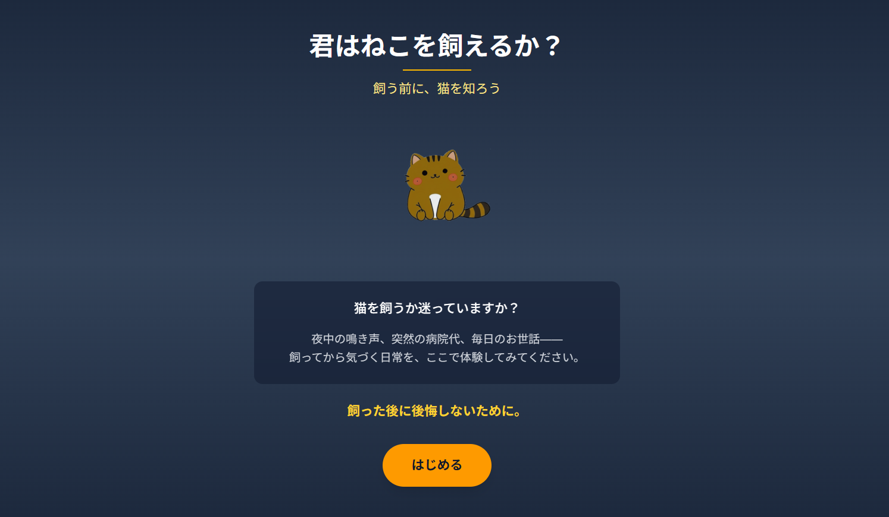
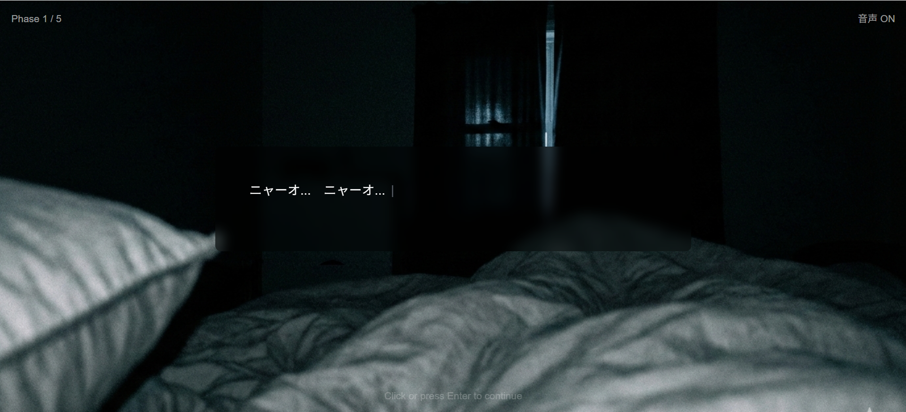
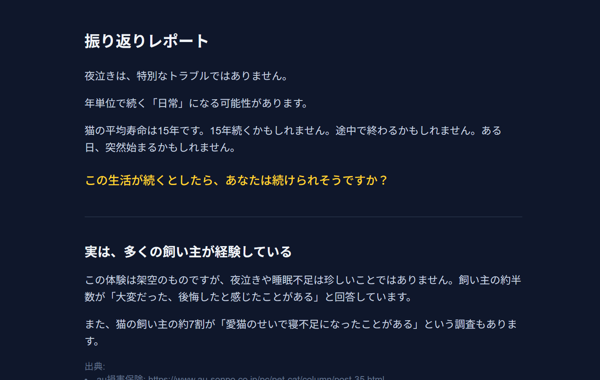

※プレスリリースの原稿。最終版は、https://neko-engineer.com/press/press_release_20260201.html

━━━━━━━━━━━━━━━━━━━━━━━━━━━━━
【プレスリリース】
2026年2月1日
大津隆也

━━━━━━━━━━━━━━━━━━━━━━━━━━━━━
# ねこを飼う前に「夜泣き」を疑似体験できるWebアプリ『君はねこを飼えるか？』プレビュー版を公開
━━━━━━━━━━━━━━━━━━━━━━━━━━━━━

大津隆也は、2026年2月1日、
ねこの飼育シミュレーションWebアプリ『君はねこを飼えるか？』プレビュー版を公開しました。

**▶ アプリはこちら：https://can-you-really-own-a-cat.neko-engineer.com/**

## 【アプリの特徴】

### 飼う前に「ねことの暮らしのリアル」を体験
本アプリは、「飼わないとわからないリアルな飼育体験」を疑似体験できる学習型シミュレーションゲームです。プレビュー版では、ねこの飼い主が最も後悔しやすい「睡眠妨害（夜泣き・早朝起こし）」シナリオを体験できます。

### 責任感の押し付けではなく「気づき」を提供
「あなたは疲れました」「遊んであげましょう」「飼うべきではない」といった押し付けはしません。ねことの暮らしをありのままに体験していただきます。判断材料を押し付けず、感じたことはすべてプレイヤー自身のものです。

### 気軽に失敗できる、ねこへの負担ゼロ
登録・審査・手続き不要。思い立ったらすぐ、スマホやPCひとつで始められます。疑似体験のため、実際のねこにストレスを与えることなく、失敗から学べます。

## 【プレビュー版の内容】

### シナリオ：睡眠妨害（夜泣き・早朝起こし）体験
シミュレーションでは、ねことの生活を体験します。

- **夜泣きイベント**：夜中にねこが鳴き出した時、あなたはどうなりましたか？
  - すぐまた眠れた？ 様子を見に行った？ しばらく寝付けなかった？
  - 正解・不正解ではなく、自分の傾向に気づくための選択です

- **早朝起こし**：明け方に起こされ、睡眠時間が削られていく体験

- **振り返りレポート**：あなたの体験を振り返り
  - 「この生活が続くとしたら、あなたは続けられそうですか？」

## 【開発背景】

### ねこの飼育放棄と後悔の現状
- **年間22,010頭**のねこが自治体に引き取られ、**4,866頭が殺処分**されています（令和6年度、環境省統計より）
- **約半数（47%）**の飼い主が「大変だった・後悔した」と感じたことがある（ねこのきもちWEB MAGAZINE 2024年調査より）
- **約7割（68.7%）**の飼い主が「愛猫のせいで寝不足になった」と回答（同調査より）

調べれば分かる情報（費用、必要な用品など）は事前に確認できますが、「毎晩3時に起こされる生活が何週間も続く」という日常のリアルは、実際に飼ってみないと分かりません。

本アプリは、この「体験しないと分からない大変さ」を飼う前に疑似体験することで、後悔のない飼育判断を促すことを目的としています。

## 【対象ユーザー】

ねこを飼おうか迷っている方。特に、調べても気づけない「日常のリアル」に不安を感じている方に最適です。

## 【今後の展開】

プレビュー版で得られたフィードバックをもとに、以下のシナリオを順次追加予定です：

- 衛生面の現実（嘔吐、抜け毛、トイレ掃除）
- 問題行動（家具への爪とぎ、物を壊される）
- 突発的な医療費
- 生活の自由度への影響（旅行、外出の制約）
- 老齢期の介護

## 【ミッション】

**「すべての動物が幸せな世界をつくる」**

飼育シミュレーションを通じて、ねこと人の適切な関係性を構築できる社会を実現することを目指しています。

**タグライン：「飼う前に、ねこを知ろう」**

## 【配信情報】

- リリース日：2026年2月1日（プレビュー版）
- 対応プラットフォーム：Webアプリ（スマートフォン・PC対応）
- プレイ時間：約30分〜1時間
- 価格：無料

## 【デモ動画】

## 【開発者情報】

- 開発者：大津隆也
- 所在地：千葉県船橋市
- 公式サイト：https://can-you-really-own-a-cat.neko-engineer.com/
- 公式SNS：https://x.com/neko_engineer_

## 【参考データ】

- ねこの引取り数・殺処分数：[環境省 犬・猫の引取り及び負傷動物等の収容並びに処分の状況](https://www.env.go.jp/nature/dobutsu/aigo/2_data/statistics/dog-cat.html)
- 後悔調査：[ねこのきもちWEB MAGAZINE](https://cat.benesse.ne.jp/withcat/content/?id=184119)
- 寝不足調査：[ねこのきもちWEB MAGAZINE](https://cat.benesse.ne.jp/withcat/content/?id=47214)

━━━━━━━━━━━━━━━━━━━━━━━━━━━━━

※本プレスリリースに記載の内容はプレビュー版時点のものであり、正式リリース時には変更される可能性があります。
